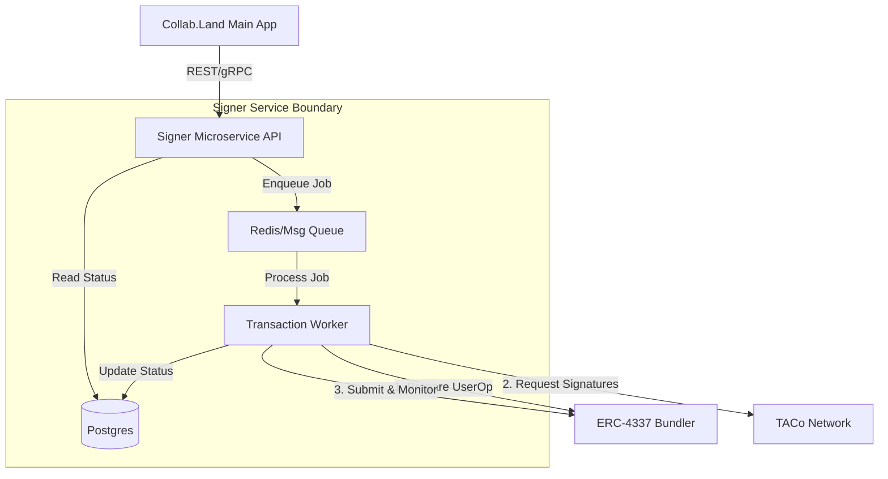

# Design: TACo-MDT Signer Microservice

## Goal

Integrate the [TACo-MDT-AA PoC](https://github.com/derekpierre/TACoCollab) into the Collab.Land ecosystem as a dedicated microservice.
**Objective**: Provide a clean, scalable abstraction for creating Smart Accounts and executing transactions (UserOps) secured by TACo threshold signatures.

## Core Responsibilities

1.  **Account Management**: Deterministically derive and deploy Smart Accounts for Collab.Land users/communities.
2.  **Signing Orchestration**: Act as the coordinator that collects threshold signatures from the TACo network (Ursulas).
3.  **Transaction Relay**: Submit signed UserOperations to ERC-4337 Bundlers and monitor their status.

---

## Architecture Plan

### Components



### Data Model (Minimal)

- **Accounts Table**:
  - `ownerId` (Collab.Land User/Community ID)
  - `salt` (Unique seed for address derivation)
  - `address` (The calculated Smart Account address)
  - `chainId` (Network ID)
- **Transactions Table**:
  - `id` (UUID)
  - `accountId` (FK)
  - `userOpHash`
  - `status` (QUEUED, SIGNING, SUBMITTED, MINED, FAILED)
  - `txHash` (On-chain generic transaction hash)
  - `payload` (JSON: target, value, data)

---

## Levels of Scale

### Level 1: The "Sidecar" (MVP)

**Best for**: Proof of Value, Hackathons, Low volume (< 100 tx/day).

- **Architecture**: Single Node.js process.
- **Database**: SQLite or single MongoDB instance.
- **Async**: In-memory job queue (e.g., `bull` or simple promises).
- **Pros**: Extremely fast to deploy; low infrastructure cost.
- **Cons**: No redundancy; restarts kill pending jobs; single point of failure.

### Level 2: Production Microservice

**Best for**: Live roll-out, steady traffic, reliability required.

- **Architecture**: Separate API (Stateless) and Worker (Stateful logic) containers.
- **Database**: Managed Postgres (AWS RDS / Cloud SQL).
- **Async**: Redis (for persistent job queues).
- **Scaling**: 1 API replica, 1-2 Worker replicas.
- **Optimization**: Implement **Paymaster** logic (sponsoring gas) effectively here to avoid managing ETH for every account.

### Level 3: High Scale / Global

**Best for**: Millions of users, high-frequency gaming/defi events.

- **Architecture**: Event-driven architecture.
- **Scaling**: Auto-scaling Worker groups based on Queue depth.
- **Performance**:
  - **Nonce Management**: Distributed locking (Redlock) to prevent nonce collisions when multiple ops come for the same account.
  - **Caching**: Cache Account Address derivations to avoid recalculating.
  - **Multi-Chain**: Dedicated workers per Chain ID to manage RPC limits effectively.

---

## Implementation Roadmap

### Phase 1: Service Skeleton (Level 1)

- [ ] Initialize NestJS or Express TypeScript project.
- [ ] Port `src/index.ts` logic into a Service Class (`TacoSignerService`).
- [ ] Define API Schema (OpenAPI/Swagger).
- [ ] Implement `POST /sign-execute` endpoint.

### Phase 2: Asynchronous Workers (Level 2)

- [ ] Introduce BullMQ + Redis.
- [ ] Split logic: API accepts request -> Returns Job ID immediately.
- [ ] Worker processes the lengthy "Collect TACo Signatures" step.
- [ ] Add Webhook mechanism (call back to Collab.Land App when Tx creates).

### Phase 3: Infrastructure & Security

- [ ] Secure `salt` generation (ensure salts are unique per user but deterministic).
- [ ] Integrate a **Verifying Paymaster** (allow transaction fees to be paid in ERC20s or sponsored by Collab.Land).

## API Contract (Draft)

**1. Get/Create Account**

```http
POST /v1/account
{
  "ownerId": "discord:12345",
  "chainId": 84532
}
// Returns: { "address": "0x...", "isDeployed": false }
```

**2. Execute Transaction**

```http
POST /v1/execute
{
  "ownerId": "discord:12345",
  "chainId": 84532,
  "tx": {
    "to": "0x...",
    "value": "0",
    "data": "0x..."
  }
}
// Returns: { "jobId": "job_abc123", "status": "QUEUED" }
```
